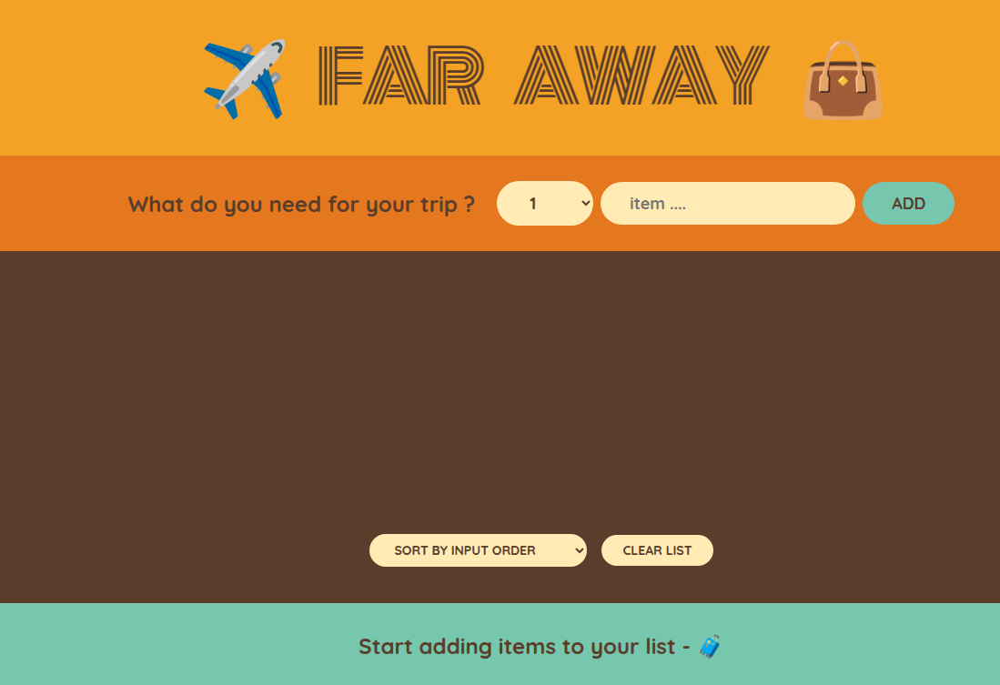

# Travel Packing List App

A simple React app to help you track items needed for travel. This app allows you to add items to a list, mark them as packed, and sort the list. It’s a great project for learning basic React state management and component structure. The project is part of Jonas's React course

---

## Features

- **Add Items**: Add new items to your travel packing list.
- **Track Items**: See the total number of items and how many are packed.
- **Mark as Packed**: Toggle items between "packed" and "unpacked."
- **Sort Items**: Sort items by description, packed status, or input order.
- **Delete Items**: Remove items you no longer need.

---

## Screenshots

 <!-- Add a screenshot if available -->

---

## Technologies Used

- **React**: JavaScript library for building user interfaces.
- **CSS**: Basic styling for the app.
- **Create React App**: Toolchain for setting up the project.

---

## Installation and Setup

Follow these steps to run the app locally:

1. **Clone the Repository**:

   ```bash
   git clone https://github.com/your-username/travel-packing-list.git
   ```

2. **Navigate to the Project Directory**:

   ```bash
   cd travel-packing-list
   ```

3. **Install Dependencies**:

   ```bash
   npm install
   ```

4. **Run the Development Server**:

   ```bash
   npm start
   ```

5. **Open the App**:
   - The app will open automatically in your browser at `http://localhost:3000`.
   - If it doesn’t, manually navigate to the URL.

---

## How to Use the App

1. **Add Items**:

   - Type the item name in the input field and click "Add" or press Enter.

2. **Mark Items as Packed**:

   - Click the checkbox next to an item to mark it as packed.

3. **Sort Items**:

   - Use the "Sort by" dropdown to sort items by:
     - **Input Order**: The order in which items were added.
     - **Description**: Alphabetical order.
     - **Packed Status**: Packed items first or last.

4. **Delete Items**:

   - Click the trash icon next to an item to remove it from the list.

5. **Track Progress**:
   - The app displays the total number of items and how many are packed.

---

## Project Structure

```
travel-packing-list/
├── public/                  # Static assets (e.g., index.html)
│   └── index.html
├── src/                     # React source files
│   ├── components/          # Reusable components
│   │   ├── ItemList.js      # Displays the list of items
│   │   ├── AddItem.js       # Form to add new items
│   │   └── Stats.js         # Tracks items and packed status
│   ├── App.js               # Main application component
│   ├── index.js             # Entry point
│   ├── App.css              # Styles for the App component
│   └── index.css            # Global styles
├── package.json             # Project dependencies and scripts
└── README.md                # Project documentation
```

---

## Code Example

### Adding an Item

```javascript
// AddItem.js
import { useState } from "react";

function AddItem({ onAddItem }) {
  const [itemName, setItemName] = useState("");

  const handleSubmit = (e) => {
    e.preventDefault();
    if (!itemName) return;
    onAddItem(itemName);
    setItemName("");
  };

  return (
    <form onSubmit={handleSubmit}>
      <input
        type="text"
        placeholder="Add an item..."
        value={itemName}
        onChange={(e) => setItemName(e.target.value)}
      />
      <button type="submit">Add</button>
    </form>
  );
}

export default AddItem;
```

### Tracking Items

```javascript
// Stats.js
function Stats({ items }) {
  const totalItems = items.length;
  const packedItems = items.filter((item) => item.packed).length;

  return (
    <footer>
      <p>
        🧳 You have {totalItems} items on your list, and you've packed{" "}
        {packedItems} ({Math.round((packedItems / totalItems) * 100)}%).
      </p>
    </footer>
  );
}

export default Stats;
```

---

## Customization

- **Add More Features**:
  - Add a category field for items (e.g., clothing, electronics).
  - Allow users to edit item names.
- **Change Styles**:
  - Modify the `App.css` or `index.css` files to customize the app’s appearance.

---

## Contributing

Contributions are welcome! If you'd like to improve this project, follow these steps:

1. Fork the repository.
2. Create a new branch (`git checkout -b feature/your-feature`).
3. Commit your changes (`git commit -m 'Add some feature'`).
4. Push to the branch (`git push origin feature/your-feature`).
5. Open a pull request.

---

## License

This project is open-source and available under the [MIT License](LICENSE).

---

## Acknowledgments

- This project was created to practice React state management and component structure.
- Inspired by [Jonas's React course].

---

Enjoy packing for your next trip with this app! 🚀

---

Let me know if you need further assistance! 😊
